# Phase 0 Diagrams

## A. System Architecture

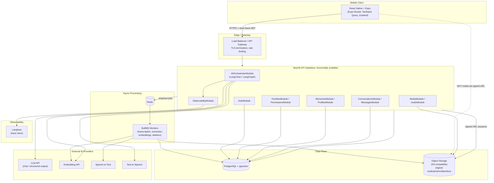

## B. AI / RAG Pipeline

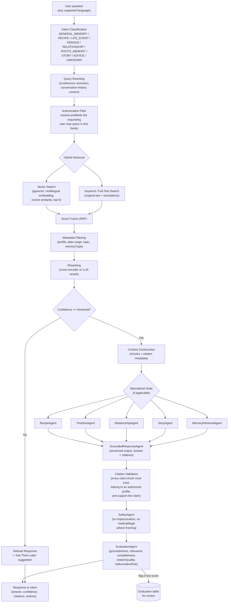

## C. Audio Processing Pipeline

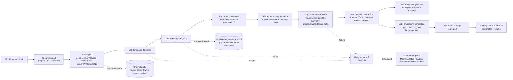

## D. Security Architecture

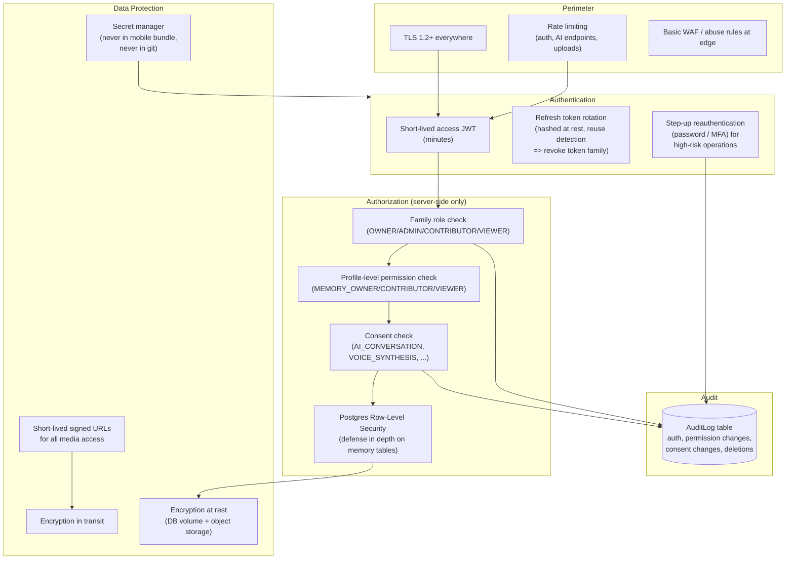

## Flow A — Account Registration

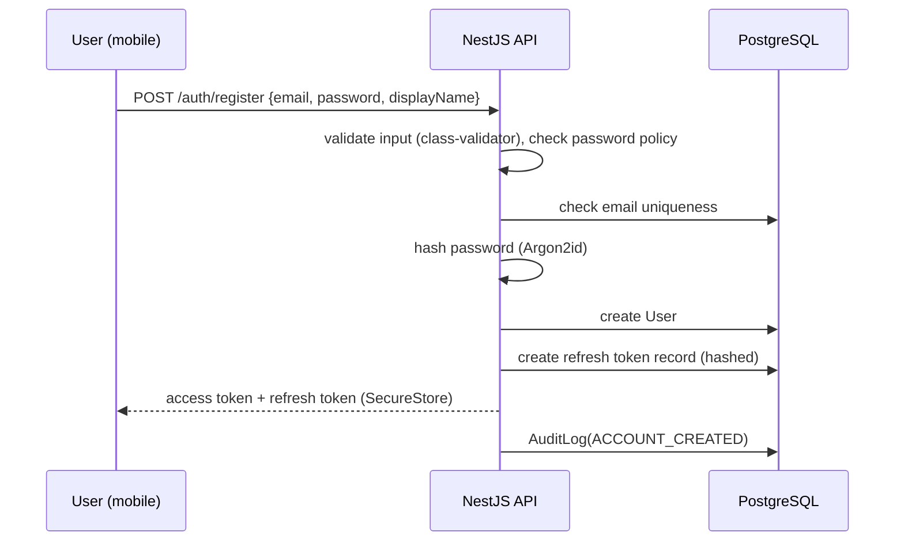

## Flow B — Create Memory Profile

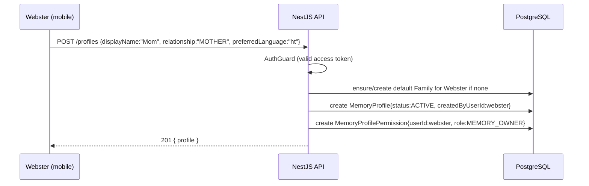

## Flow C — Invite Family Member

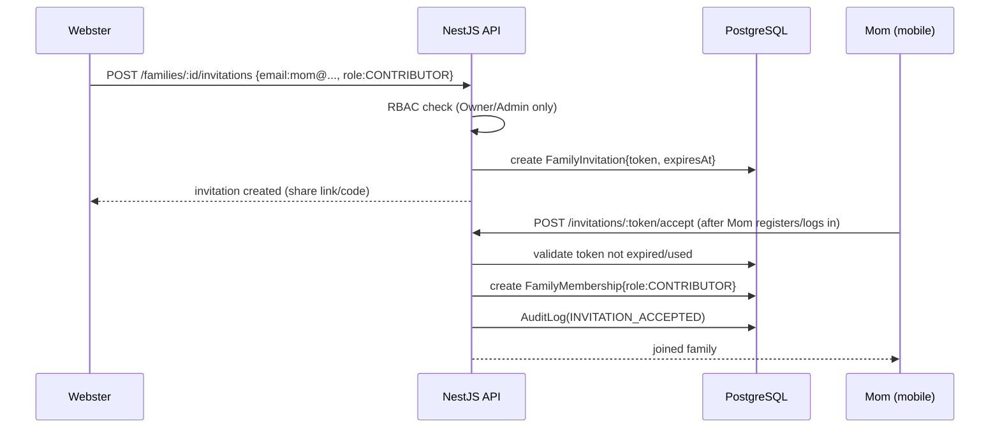

## Flow D — Record Audio Memory

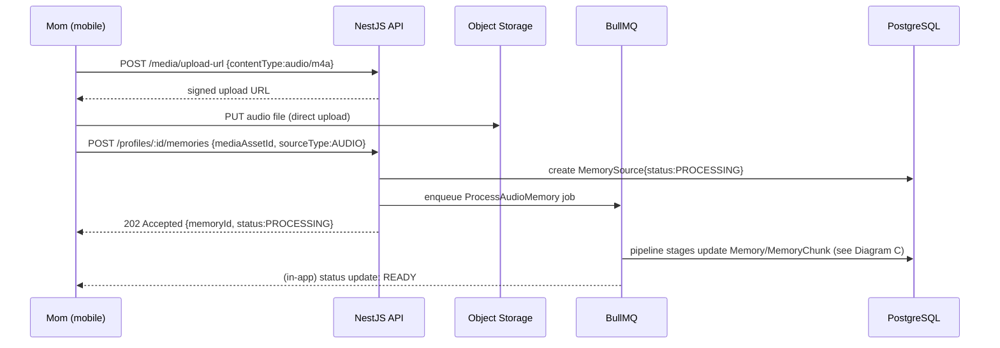

## Flow E — Guided AI Memory Interview

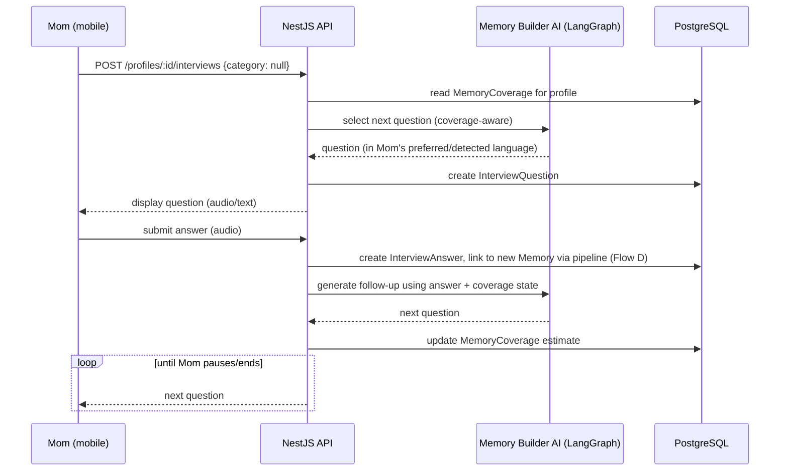

## Flow F — Ask a Memory Question

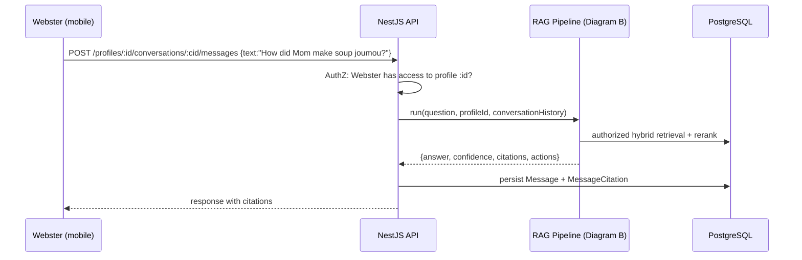

## Flow G — Cross-Language Memory Question

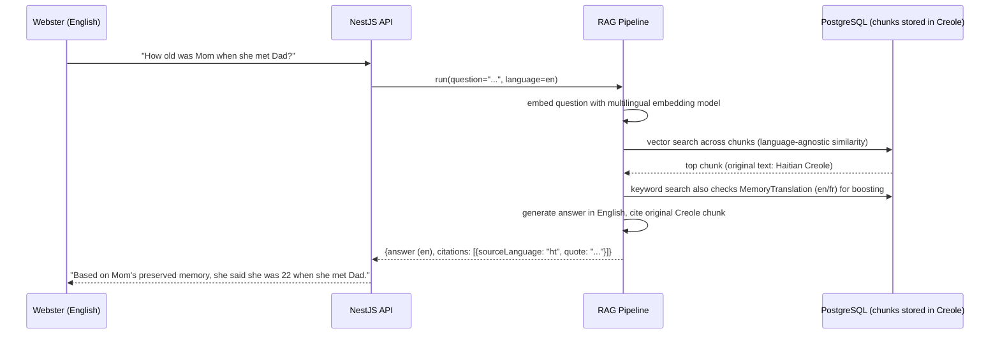

## Flow H — Knowledge Gap → Ask Them Later

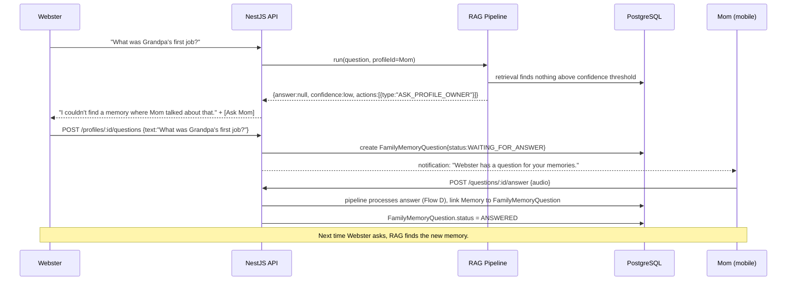

## Flow I — Original Source Playback

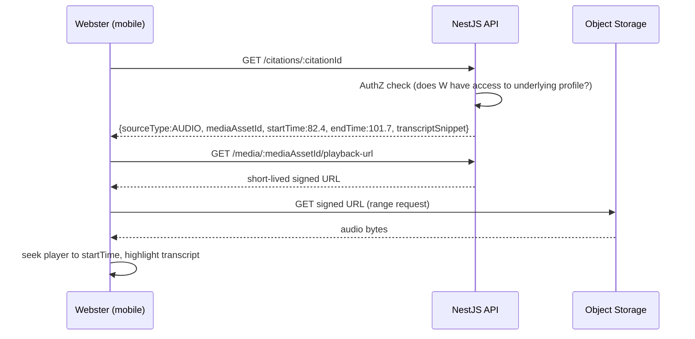

## Flow J — Voice Conversation (future, design-only)

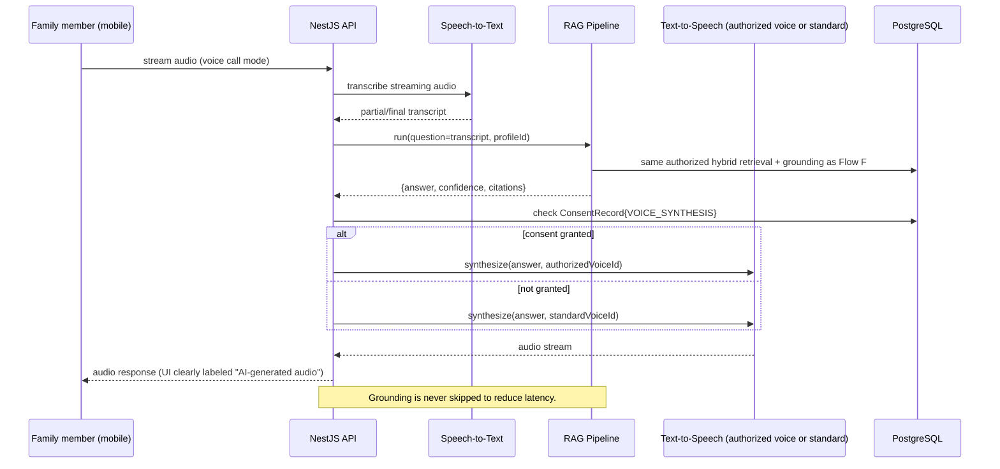

## Flow K — Delete Individual Memory

```mermaid
sequenceDiagram
    participant U as Memory owner / authorized user
    participant API as NestJS API
    participant DB as PostgreSQL
    participant Q as BullMQ

    U->>API: DELETE /memories/:id
    API->>API: AuthZ check (ownership/role)
    API-->>U: confirm dialog: "This removes N chunks, audio, transcript..."
    U->>API: DELETE /memories/:id?confirm=true
    API->>DB: transaction: Memory.status=DELETED, deletedAt=now() (tombstone)
    Note over API,DB: Tombstone check is part of every retrieval query;\nmemory is unsearchable immediately, before cleanup runs.
    API->>Q: enqueue PhysicalDeletion job
    API->>DB: AuditLog(MEMORY_DELETED)
    API-->>U: 202 Accepted
    Q->>DB: delete MemoryChunk rows, embeddings
    Q->>Q: delete MediaAsset from object storage
    Q->>DB: mark DeletionRequest.status=COMPLETED
```

## Flow L — Delete Entire Memory Profile

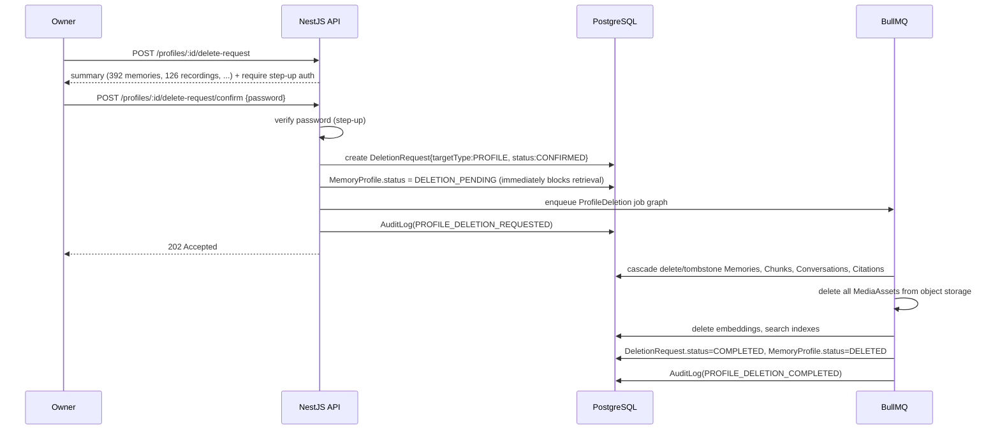

## Flow M — Account Deletion

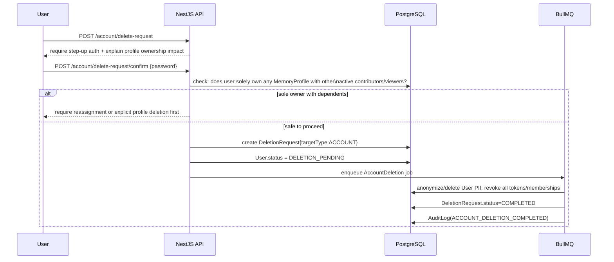

## Flow N — Voice Consent / Revocation

```mermaid
sequenceDiagram
    participant Mom as Profile owner (Mom)
    participant API as NestJS API
    participant DB as PostgreSQL

    Mom->>API: POST /profiles/:id/consent {type:VOICE_SYNTHESIS, action:GRANT}
    API->>API: step-up auth required
    API->>DB: create ConsentRecord{type:VOICE_SYNTHESIS, status:GRANTED, evidence}
    API->>DB: AuditLog(CONSENT_GRANTED)
    API-->>Mom: voice synthesis features unlocked

    Mom->>API: POST /profiles/:id/consent {type:VOICE_SYNTHESIS, action:REVOKE}
    API->>DB: ConsentRecord.status = REVOKED, revokedAt=now()
    API->>DB: disable VoiceProfile immediately (checked on every synth request)
    API->>DB: AuditLog(CONSENT_REVOKED)
    API-->>Mom: confirmation; app falls back to original audio / standard voice
```
