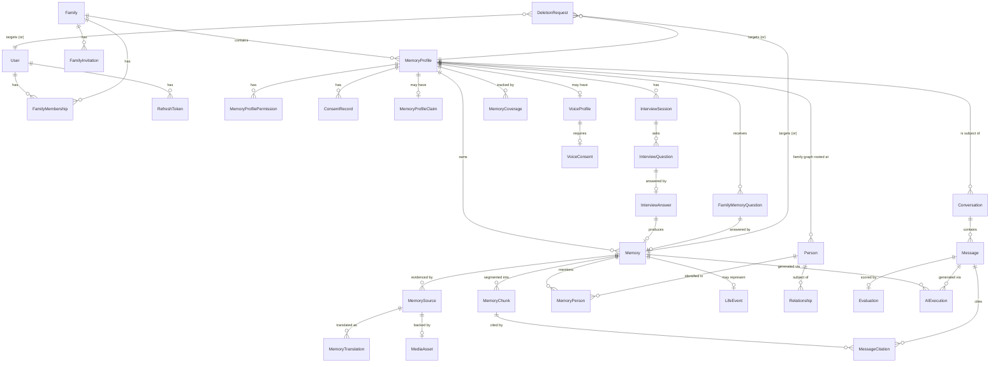

# Domain Model

## 1. Bounded contexts

Rather than one flat schema, the domain splits into contexts with clear
ownership. Cross-context references are by ID only (no cross-context FK
cascades that could silently leak data across boundaries).

| Context | Owns | Notes |
|---|---|---|
| **Identity & Access** | User, RefreshToken, Family, FamilyMembership, FamilyInvitation | Who can log in, who belongs to which family, at what role |
| **Memory Profile** | MemoryProfile, MemoryProfileClaim, MemoryProfilePermission, ConsentRecord | Who is being remembered, and who controls that |
| **Memory Capture** | Memory, MemorySource, MemoryTranslation, MemoryChunk, MediaAsset | The actual preserved content, in original and derived forms |
| **Family Graph** | Person, Relationship, LifeEvent | Explicitly stated biographical facts, never inferred |
| **Interview** | InterviewSession, InterviewQuestion, InterviewAnswer, MemoryCoverage | Memory Builder AI state |
| **Question Queue** | FamilyMemoryQuestion | "Ask Them Later" loop |
| **Conversation** | Conversation, Message, MessageCitation | Memory Conversation AI state |
| **Voice** | VoiceProfile, VoiceConsent | Synthesis capability, gated by consent |
| **AI Operations** | AIExecution, Evaluation | Cost/quality metrics, provider-agnostic |
| **Processing** | ProcessingJob, DeletionRequest | Durable record of async work (BullMQ/Redis state is ephemeral, this is the queryable ledger) |
| **Billing (design only)** | Subscription | Plan/quota fields exist; no payment integration in MVP |
| **Audit** | AuditLog | Cross-cutting, append-only |

## 2. Normalization decisions (why some entities from the brief are merged)

The brief lists many candidate entities and explicitly warns against
blindly creating all of them. Decisions:

- **Photo / Video / Document are not separate tables.** They differ only in
  `MediaAsset.type` and a few type-specific fields (e.g., video duration).
  Modeling them as three near-identical tables would triplicate every media
  query. Instead: one `MediaAsset` table with a `type` enum and a small
  `metadata jsonb` column for type-specific attributes. A `Memory` of
  `sourceType: PHOTO` references a `MediaAsset` plus the user's description.
- **RecipeIngredient is not a separate table in MVP.** A recipe is a `Memory`
  with `memoryType: RECIPE` and a structured `metadata jsonb` field
  (`{ingredients: [...], steps: [...]}`) produced by extraction. A dedicated
  relational `RecipeIngredient` table only pays off once we need to query
  *across* recipes by ingredient (e.g., "find all recipes using plantain") —
  that's a Phase 13+ enhancement, not MVP. The JSON is still schema-validated
  at the application layer (Zod) even though Postgres stores it loosely.
- **MemoryTopic / MemoryPerson as link tables, not free columns, where they
  need referential integrity.** Topics remain a `text[]` column with a GIN
  index (cheap, no need to dedupe topic strings across profiles). People are
  a real link table (`MemoryPerson`) because they must optionally resolve to
  a `Person` node in the Family Graph — that referential link is the whole
  point of the graph feature.
- **VoiceConsent is a specialization of ConsentRecord, not a duplicate.**
  `ConsentRecord` covers all consent *types* generically (sharing, AI
  conversation, export, post-mortem access, voice). `VoiceConsent` adds the
  fields specific to voice (sample audio reference, provider verification
  method) and has a 1:1 FK to the `ConsentRecord{type:VOICE_SYNTHESIS}` row,
  rather than re-implementing status/audit fields.
- **ProcessingJob is a deliberate addition beyond the brief's list.** BullMQ
  job state lives in Redis and can be lost/rotated. Since "why did this
  memory get stuck in PROCESSING" is a support/debugging necessity (and
  eventually an admin-dashboard requirement), we persist a durable row per
  job in Postgres, updated by the worker at each stage transition.
- **Subscription exists as a schema stub only.** Fields for `plan` and a
  `quotas jsonb` blob are created now so nothing else in the schema has to
  be retrofitted later, but no billing provider integration happens before
  Phase 15.

## 3. Entity-relationship diagram



*(Not every column is shown — see §4 for field-level detail on the tables
most relevant to Phase 0 decisions.)*

## 4. Key tables (field-level)

```
User
  id, email (unique), passwordHash, displayName, preferredLanguage,
  mfaEnabled, status[ACTIVE, DELETION_PENDING, DELETED], createdAt, updatedAt

RefreshToken
  id, userId, tokenHash, tokenFamilyId, expiresAt, revokedAt,
  replacedByTokenId, deviceInfo, createdAt
  -- reuse of a revoked token => revoke entire tokenFamilyId (theft detection)

Family
  id, name, ownerUserId, createdAt

FamilyMembership
  id, familyId, userId, role[OWNER, ADMIN, CONTRIBUTOR, VIEWER],
  status[INVITED, ACTIVE, REMOVED], joinedAt

FamilyInvitation
  id, familyId, invitedEmail, role, tokenHash, expiresAt,
  status[PENDING, ACCEPTED, EXPIRED, REVOKED], invitedByUserId, createdAt

MemoryProfile
  id, familyId, displayName, relationship, avatarMediaAssetId,
  preferredLanguage, spokenLanguages[], biography, birthInfo jsonb nullable,
  status[ACTIVE, CLAIMED, DEACTIVATED, DELETION_PENDING, DELETED],
  createdByUserId, claimedByUserId nullable, createdAt, updatedAt, deletedAt

MemoryProfileClaim
  id, profileId, claimedByUserId, verificationMethod, status[PENDING,
  VERIFIED, REJECTED], reviewedByUserId nullable, createdAt

MemoryProfilePermission
  id, profileId, userId, role[MEMORY_OWNER, CONTRIBUTOR, VIEWER],
  grantedByUserId, grantedAt, revokedAt nullable

ConsentRecord
  id, profileId, type[AI_CONVERSATION, VOICE_SYNTHESIS, SHARING,
  POST_MORTEM_ACCESS, EXPORT, DELETION_AUTHORITY],
  status[GRANTED, REVOKED, NOT_REQUESTED], grantedByUserId,
  grantedAt, revokedAt, evidence jsonb

Memory
  id, profileId, memoryType[CHILDHOOD_STORY, RECIPE, LIFE_EVENT, ADVICE,
  FAMILY_HISTORY, MESSAGE_TO_FUTURE, GENERAL, ...], title, summary,
  originalLanguage, status[PROCESSING, READY, FAILED, DELETED],
  sourceType[AUDIO, TEXT, PHOTO, VIDEO, DOCUMENT, INTERVIEW],
  approximateDate, dateCertainty[EXACT, APPROXIMATE, YEAR_ONLY, UNKNOWN],
  visibility[FAMILY, PRIVATE], metadata jsonb, createdByUserId,
  createdAt, updatedAt, deletedAt (tombstone)

MemorySource
  id, memoryId, sourceType, mediaAssetId nullable, rawText nullable,
  transcript nullable, detectedLanguage, durationSeconds nullable,
  createdAt
  -- IMMUTABLE after creation; never overwritten by cleanup/translation

MemoryTranslation
  id, sourceId, targetLanguage, translatedText, generatedByModel,
  createdAt

MemoryChunk
  id, memoryId, sourceId, profileId (denormalized for fast authz filter),
  speaker nullable, chunkText, startTimestamp, endTimestamp, language,
  embedding vector(N), topics text[], people text[], approximateDate,
  createdAt

MediaAsset
  id, ownerProfileId, type[AUDIO, IMAGE, VIDEO, DOCUMENT], storageKey,
  mimeType, sizeBytes, checksum, uploadedByUserId, createdAt

Person
  id, familyId, displayName, relationshipToProfile, sourceMemoryId
  nullable, createdAt

Relationship
  id, personAId, personBId, type[MOTHER, FATHER, SPOUSE, CHILD, SIBLING,
  GRANDPARENT, OTHER], sourceMemoryId, createdAt

LifeEvent
  id, profileId, title, eventType, approximateDate, dateCertainty,
  description, sourceMemoryId, createdAt

InterviewSession / InterviewQuestion / InterviewAnswer / MemoryCoverage
  -- see 04-ai-architecture.md §2 for full detail

FamilyMemoryQuestion
  id, profileId, askedByUserId, questionText, status[WAITING_FOR_ANSWER,
  ANSWERED, DECLINED, EXPIRED], answeredMemoryId nullable, createdAt,
  answeredAt

Conversation / Message / MessageCitation
  -- see 04-ai-architecture.md §4

VoiceProfile
  id, profileId, provider, providerVoiceId nullable,
  status[NOT_CONFIGURED, TRAINING, READY, DISABLED], createdAt

VoiceConsent
  id, consentRecordId (FK -> ConsentRecord), sampleMediaAssetId,
  verificationMethod, createdAt

AIExecution
  id, operation, provider, model, promptVersion, promptTokens,
  completionTokens, totalTokens, latencyMs, estimatedCostUsd, success,
  errorType nullable, traceId, profileId nullable, userId nullable,
  createdAt

Evaluation
  id, messageId, groundedness, relevance, completeness, citationQuality,
  hallucinationRisk, explanation, flagged, createdAt

ProcessingJob
  id, jobType, entityType, entityId, status[QUEUED, PROCESSING, COMPLETED,
  FAILED, RETRYING], attempts, lastError, createdAt, completedAt

DeletionRequest
  id, targetType[MEMORY, PROFILE, ACCOUNT], targetId, requestedByUserId,
  status[PENDING_REAUTH, CONFIRMED, IN_PROGRESS, COMPLETED, FAILED],
  reauthAt, createdAt, completedAt

AuditLog
  id, actorUserId nullable, action, entityType, entityId, metadata jsonb,
  ipAddress, createdAt
  -- append-only; never updated or deleted
```

## 5. pgvector strategy

- **Column**: `MemoryChunk.embedding vector(N)` where `N` matches the chosen
  embedding model's output dimension (e.g., 1536 or 3072 — see ADR-009 and
  open question #2 in the executive summary). Dimension is fixed at
  migration time; changing embedding models later requires a re-embedding
  migration, not a schema change.
- **Index**: HNSW index (`USING hnsw (embedding vector_cosine_ops)`) once
  pgvector ≥ 0.5 is confirmed available on the chosen Postgres host. IVFFlat
  is a documented fallback if the host doesn't yet support HNSW, with a
  noted quality tradeoff (approximate recall) that should be revisited before
  scale.
- **Similarity metric**: cosine distance, since embedding magnitude is not
  semantically meaningful for the chosen model family.
- **Mandatory authorization predicate.** Every vector query is generated by
  a single repository method (`MemoryChunkRepository.searchByEmbedding`) that
  **always** injects `WHERE profile_id = ANY(:authorizedProfileIds) AND
  memory.deleted_at IS NULL` before the `ORDER BY embedding <=> :queryVector`
  clause. No other code path is allowed to run a raw vector query — this is
  enforced by code review convention *and* backed by Postgres Row-Level
  Security as a second, independent layer (a session variable set per request
  to the caller's authorized profile IDs; RLS policy denies rows outside it).
  See `07-security-privacy-deletion.md` §2 for the full defense-in-depth
  argument — a single-layer filter is not acceptable given the sensitivity
  of this data.
- **Chunk size**: semantic, not fixed-character (see extraction pipeline in
  `04-ai-architecture.md`). Typical target: one coherent "memory unit" per
  chunk (roughly 1–3 sentences to a short paragraph), because that's the
  natural unit for a citation ("this is the sentence that supports the
  claim"), not an arbitrary token window.
- **Hybrid retrieval implementation**: Postgres full-text search
  (`tsvector`/`tsquery`, `simple`/`unaccent` config since Haitian Creole has
  no built-in FTS config) runs in parallel with the vector search; results
  are combined via Reciprocal Rank Fusion (RRF) rather than a hand-tuned
  weighted sum, since RRF is parameter-light and robust across query types.
- **Reranking**: for MVP, a lightweight cross-encoder call (or a single LLM
  call scoring top-20 candidates) reorders the fused top-K before the
  confidence gate — this is the step most responsible for cross-lingual
  answer quality, since first-pass vector similarity alone is noisier across
  languages.
