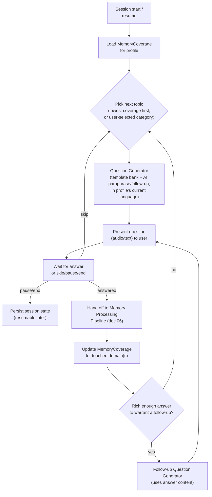

# AI Architecture

## 1. Two AI systems — never mixed

| | Memory Builder AI | Memory Conversation AI |
|---|---|---|
| Purpose | Help a person **create** memories | Help authorized family **explore** existing memories |
| Primary user | The profile owner/contributor (the one being remembered) | Any authorized family member |
| Core loop | Ask → listen → extract → track coverage → ask better next question | Question → retrieve → ground → cite → answer |
| Failure mode to avoid | Being a rigid static form | Inventing facts that were never said |
| Implementation | LangGraph stateful interview graph | LangGraph stateful RAG graph |
| Data written | Memory, MemorySource, InterviewSession/Question/Answer, MemoryCoverage | Conversation, Message, MessageCitation |

They share the downstream **memory processing pipeline** (transcription →
extraction → embeddings, see `06-audio-pipeline-jobs-storage.md`) but never
share prompts, graphs, or response logic. A code review red flag: any change
that makes the interview graph call the grounded-answer generator, or vice
versa, is a boundary violation.

## 2. Memory Builder AI — adaptive interview

### Coverage model

`MemoryCoverage{profileId, domain, coverageScore 0..1, lastUpdatedAt}` — one
row per domain per profile:

```
CHILDHOOD, FAMILY, EDUCATION, RELATIONSHIPS, MARRIAGE, CHILDREN, CAREER,
MIGRATION, CULTURE, FAITH, FOOD, RECIPES, TRAVEL, LIFE_LESSONS,
IMPORTANT_EVENTS, FUTURE_MESSAGES
```

`coverageScore` is **not** a ground-truth measurement — it's a heuristic
estimate derived from: (a) count and diversity of memories tagged with that
domain by the extraction step, (b) explicit interview questions
answered/skipped in that domain, (c) a decay-free simple average (no need to
overengineer this in MVP — a running count normalized against an expected
target count per domain is enough to rank "what's least explored").

### Interview graph (LangGraph)



### Question generation strategy

- **MVP**: a curated template bank per category (translated into the
  supported languages up front by a human translator/reviewer, not
  machine-translated at runtime — these are the AI's own words and must read
  naturally). Template selection is coverage-driven (§ above).
- **Phase 9+ enhancement**: an LLM call rewrites/personalizes the next
  template question using recent conversation context (e.g., "You mentioned
  your grandmother taught you to cook — what do you remember about cooking
  with her?") — this is the "follow-up question" capability from the brief.
  This call is a plain LangChain LCEL chain (single prompt, structured
  output: `{question: string, category: string}`), not a full agent — no
  measurable value from more machinery here.
- **Interview safety** is enforced structurally, not just as a prompt
  instruction: every question presentation includes skip/pause/end controls
  in the API response contract itself (`actions: ["skip","pause","end"]`),
  and the prompt explicitly instructs the model never to push back if the
  user skips or declines a topic.

## 3. Memory Conversation AI — RAG pipeline

Full flow diagram in `01-diagrams.md` (Diagram B). Stage-by-stage detail:

1. **Intent classification** — single small/cheap LLM call (or a fine-tuned
   classifier later), structured output:
   `{intent: GENERAL_MEMORY|RECIPE|LIFE_EVENT|PERSON|RELATIONSHIP|PHOTO_MEMORY|STORY|ADVICE|UNKNOWN, confidence}`.
2. **Query rewriting** — resolves pronouns/context from `conversationHistory`
   ("What about her sister?" → "What about Mom's sister?"). Skipped when the
   question is already self-contained (cheap heuristic: first turn in a
   conversation, or no pronouns detected).
3. **Authorization filter** — resolves the requesting User's accessible
   `profileId` set for the family in question (see doc 03 §8). This always
   runs before retrieval, never after.
4. **Hybrid retrieval** — vector search (pgvector, multilingual embedding) +
   keyword/full-text search, fused via Reciprocal Rank Fusion. See
   `02-domain-model.md` §5 for index/authorization detail.
5. **Metadata filtering** — narrows by profile, approximate date range (if
   the rewritten query implies one), topics, memoryType — applied as SQL
   predicates alongside the vector/FTS query, not as a post-filter on
   already-fetched rows (avoids under-filling top-K).
6. **Reranking** — cross-encoder or LLM-based rerank of the fused top-K
   (e.g., top 20 → top 5). This is the primary lever for retrieval quality
   and the main mitigation for cross-lingual noise.
7. **Confidence gate** — if the top reranked score is below a calibrated
   threshold, the pipeline **short-circuits to a refusal response** and never
   invokes the generation node. Threshold is per-language configurable (see
   executive summary, risk #2) and stored in the versioned prompt/config
   system (§5), not hardcoded inline.
8. **Context construction** — builds the generation prompt's evidence block
   from the surviving chunks, each tagged with a stable citation reference
   ID so the model can only cite chunks it was actually given.
9. **Specialized node dispatch** — based on intent, route to a thin
   specialization (`RecipeAgent`, `TimelineAgent`, `RelationshipAgent`,
   `StoryAgent`) that mainly adjusts prompt framing/output shape (e.g.,
   `RecipeAgent` expects to structure `ingredients`/`steps`) — or the generic
   `MemoryRetrievalAgent` for anything else. These are prompt variants sharing
   one grounded-generation core, not independent codepaths — see §6 for why.
10. **Grounded generation** (`GroundedResponseAgent`) — structured output:
    `{answer, confidence, citedChunkIds[]}`.
11. **Citation validation** — every `citedChunkIds` entry must (a) exist,
    (b) belong to a profile in the authorized set, (c) have actually been
    included in the context passed to the model. Any citation failing this
    check is dropped and, if **zero** valid citations remain for a
    factual claim, the response is downgraded to a refusal rather than
    shipped uncited — this is the hard backstop against hallucination
    slipping through generation.
12. **SafetyAgent** — checks the answer doesn't claim to *be* the person
    ("I am your mother") and doesn't present preserved recollections as
    current professional (medical/legal/financial) advice; rewrites framing
    to "Based on the memories your mother preserved..." if needed.
13. **EvaluationAgent** — scores the final answer (see §7). Runs
    asynchronously relative to the response when possible (don't make the
    user wait on eval), logged against the `Message`.
14. **Response** — `{answer, confidence, citations[], actions[]}` per the
    contract in the brief.

## 4. Citation contract

```json
{
  "answer": "Based on a memory Mom preserved on 2024-03-12, she said she starts by browning the meat with cloves and sour orange juice.",
  "confidence": 0.87,
  "citations": [
    {
      "memoryId": "mem_...",
      "sourceId": "src_...",
      "chunkId": "chk_...",
      "sourceType": "audio",
      "sourceLanguage": "ht",
      "quote": "Mwen konn kòmanse lè m sote vyann nan ak jiwòf...",
      "startTime": 82.4,
      "endTime": 101.7
    }
  ],
  "actions": []
}
```

When retrieval is insufficient:

```json
{
  "answer": "I couldn't find a memory where Mom talked about Grandpa's first job.",
  "confidence": 0.0,
  "citations": [],
  "actions": [
    { "type": "ASK_PROFILE_OWNER", "profileId": "prof_mom", "suggestedQuestion": "What was Grandpa's first job?" }
  ]
}
```

`MessageCitation` rows persist this at write time so history remains
inspectable even if underlying memories later change (though a citation
pointing at a deleted memory must itself stop resolving — see doc 07 §3).

## 5. Prompt versioning system

```
apps/api/src/ai/prompts/
  memory-answer/
    v1.ts
  memory-extraction/
    v1.ts
  intent-router/
    v1.ts
  query-rewrite/
    v1.ts
  evaluator/
    v1.ts
  safety-review/
    v1.ts
  interview-question/
    v1.ts
```

Rules:
- Each versioned file exports a typed prompt template (system role, context
  delimiters, few-shot examples where useful, and the Zod output schema it
  targets) plus a constant `PROMPT_VERSION` string, e.g. `"memory-answer.v1"`.
- **Controllers and services never inline prompt text.** They call
  `AIOrchestratorModule` methods, which internally select the active prompt
  version (a simple config value, promotable to a feature flag later for
  A/B testing prompt revisions without a deploy).
  can compare quality/cost across versions).
- Confidence thresholds, few-shot examples, and refusal phrasing all live
  inside the versioned prompt module — not scattered as magic strings in
  service code — so a prompt change and its behavioral consequence ship
  together and are reviewable as one diff.
- No prompt ever requests hidden chain-of-thought. Prompts request concise
  structured reasoning fields when reasoning transparency is useful (e.g.,
  the Evaluator's `explanation` field), never a free-form "think step by
  step" dump.

## 6. LangChain / LangGraph strategy

- **LangChain** provides: chat-model abstraction (so the model provider is
  swappable behind one interface — see ADR-005), embeddings interface,
  output parsers bound to Zod schemas, and simple LCEL chains for
  single-shot, non-branching operations (memory extraction, evaluation,
  query rewriting, interview follow-up generation).
- **LangGraph** is used specifically where **stateful, conditional,
  multi-turn** control flow makes the code clearer than an if/else pile:
  1. The **RAG conversation graph** (§3) — because of the confidence gate's
     conditional short-circuit, the specialized-node dispatch, and the need
     to carry retrieval state (retrieved chunks, scores) between nodes for
     the evaluator and citation validator to inspect.
  2. The **guided interview graph** (§2) — because it's inherently a
     long-running, resumable, multi-turn state machine (pause/resume,
     coverage-driven branching).
- **Deliberately not using LangGraph for**: memory extraction (linear:
  transcript in, structured JSON out), evaluation (linear: inputs in, score
  out), translation. Wrapping single-shot calls in a graph would be
  complexity with no behavioral payoff — directly against the brief's "do
  not create agents simply for marketing" instruction.
- **"Agents" here means graph nodes with a narrow, named responsibility**,
  not autonomous tool-calling agents roaming freely. `RecipeAgent`,
  `TimelineAgent`, etc. do not independently decide to call arbitrary tools;
  they are deterministic graph nodes selected by the `IntentRouter` and share
  the same grounded-generation/citation-validation backbone. This keeps the
  system auditable — for a product whose core promise is "we don't
  hallucinate your family's memories," an unconstrained agent loop would be
  the wrong tool.

## 7. Structured output & validation

- Every LLM call that feeds application logic requests a JSON response
  matching a **Zod schema** defined in `packages/ai-schemas` (shared between
  API and, where relevant, admin tooling).
- Validation failure handling (uniform across all AI calls, implemented once
  in `AIOrchestratorModule`, not per-call):
  1. Malformed JSON → one automatic retry with a "your last response was
     invalid JSON, return only valid JSON matching this schema" repair
     prompt.
  2. Schema validation failure (valid JSON, wrong shape) → same repair retry
     path, capped at 2 attempts total.
  3. Still failing → operation fails closed: extraction marks the memory
     `FAILED` (retryable via the job's normal retry policy, not silently
     dropped); RAG generation fails closed to the refusal response, never to
     a best-effort unvalidated answer.
  4. Provider timeout / rate limit / 5xx → retried with exponential backoff
     at the job-queue level (BullMQ) for background operations; for
     synchronous RAG requests, a bounded single retry, then a clear
     "temporarily unable to answer, please try again" response — never a
     silent hang.
- `AIExecution.success` and `errorType` capture which of the above occurred,
  so failure-mode frequency is queryable, not just logged to text.

## 8. Observability (Langfuse)

Trace tree per user-facing operation, e.g. for a memory question:

```
memory-question (trace)
├── intent-classification (span)
├── query-rewrite (span, skipped if not needed)
├── authorization-filter (span, no model call — timing only)
├── hybrid-retrieval (span)
│   ├── vector-search (span)
│   └── keyword-search (span)
├── reranking (span)
├── response-generation (generation)
├── citation-validation (span)
├── safety-review (generation, small model)
├── evaluator (generation)
└── voice-generation (generation, only if voice mode)
```

Recorded per relevant span/generation: model, prompt version, input/output
tokens, latency, estimated cost, retrieved chunk IDs + similarity/rerank
scores, evaluation scores, error type if any.

**Privacy redaction policy** (this is a hard requirement, not a nice-to-have,
given the brief's "never send unnecessary private raw user data to
observability systems"):
- Full memory transcript text and full user question text are **not** sent
  to Langfuse by default. Instead: chunk **IDs**, similarity **scores**, and
  short **length metadata** are sent; the actual `quote`/`answer` text is
  redacted or truncated to a fixed short preview behind a config flag,
  defaulting to off (no raw content) in production.
- A separate, tightly access-controlled "debug mode" (per-request opt-in,
  audit-logged) can temporarily allow full-content tracing for a specific
  investigation, but this is not the default trace path.
- Langfuse hosting choice (Cloud vs. self-hosted) is an open question (see
  executive summary §7, item 10) precisely because even redacted metadata
  leaving the infra has a different risk profile depending on hosting.

## 9. AI metrics & cost abstraction

`AIExecution` is written by `AIOrchestratorModule` for **every** provider
call — chat completion, embedding, transcription, TTS — not just RAG
generation. This makes per-operation, per-family, and per-model cost
queryable from day one, before Phase 10 wires up any dashboard.

Cost calculation is centralized in a `ModelPricingTable` abstraction:

```
ModelPricingTable.estimateCostUsd({
  provider, model, operation,
  promptTokens, completionTokens,   // or durationSeconds for STT/TTS
}) => number
```

Pricing data lives in one config module (versioned, since provider pricing
changes over time), never hardcoded inline where a call happens. This
directly satisfies the brief's requirement to avoid scattering pricing
logic, and means adding a new model/provider is a config change, not a
code change across call sites.

## 10. Evaluation Agent contract

```json
{
  "groundedness": 9,
  "relevance": 10,
  "completeness": 7,
  "citationQuality": 9,
  "hallucinationRisk": 1,
  "explanation": "Answer is fully supported by the cited chunk; does not address the follow-up detail about location, hence completeness is not perfect."
}
```

- Input: `userQuestion`, `retrievedChunks` (text + IDs), `generatedAnswer`,
  `citations`.
- `flagged = true` is set automatically when `hallucinationRisk >= 6` or
  `citationQuality <= 3`, surfaced to an admin review queue (Phase 10+ UI;
  the `Evaluation` table and flag exist from MVP).
- MVP runs evaluation on 100% of generated answers (volume is low pre-launch);
  a sampling rate becomes a config value once volume/cost justifies it —
  another reason pricing/config is centralized (§9) rather than hardcoded.
