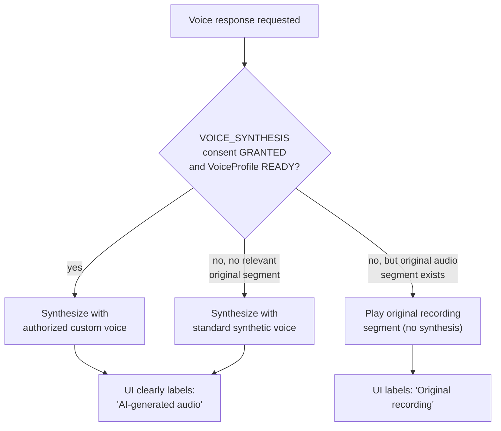
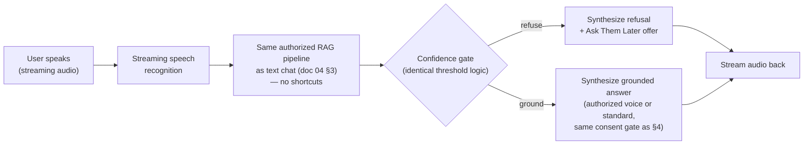

# Multilingual, Multimodal, and Voice Architecture

## 1. Multilingual-first principles

1. **Original language is the source of truth, always.** `MemorySource`
   rows are immutable once created; `transcript` is never overwritten by a
   translation. Translations live in a separate `MemoryTranslation` table
   keyed by `sourceId` + `targetLanguage`.
2. **Language is detected per source, not fixed by profile.** A profile's
   `preferredLanguage` only seeds UI defaults (which language the Memory
   Builder AI speaks first, which language answers render in by default) —
   it never restricts what language a person can actually speak into a
   recording. Detection runs on every individual `MemorySource` at ingest
   time (see doc 06).
3. **Embeddings are computed on the original-language text.** We rely on a
   multilingual embedding model whose vector space is language-agnostic
   enough that a Creole chunk and an English question about the same fact
   land close together in vector space — this is what makes Flow G (the
   cross-language question scenario) work without a translate-then-embed
   detour. See ADR-009 for the model selection tradeoff.
4. **Keyword search is bilingual-aware.** Because Postgres full-text search
   has no built-in Haitian Creole configuration, keyword search runs against
   both the original text (using a `simple`/`unaccent` FTS config, which is
   language-neutral) **and** the English/French `MemoryTranslation` text when
   available — this catches exact-term matches (names, food names, place
   names) that pure vector similarity can miss, especially for a low-resource
   language where embedding quality is less certain.
5. **Answer language matches the question's language**, independent of the
   source memory's language — the generation prompt is explicitly instructed
   to respond in the detected language of the incoming question, while
   citing (and optionally quoting) the original-language text verbatim in
   the citation object (never silently translating a direct quote without
   marking it as translated).

## 2. Automatic language detection

- Runs as the first pipeline stage after upload (`06-audio-pipeline-jobs-storage.md`,
  stage 2), using either a dedicated language-ID model or the STT provider's
  built-in detection (many Whisper-family APIs return a detected language
  alongside the transcript — confirm this is available for the chosen
  provider, see executive summary open question #3).
- Stored on `MemorySource.detectedLanguage` (ISO 639-1, e.g. `ht`, `fr`,
  `en`, `es`, `pt`).
- **Per-segment language** is supported at the `MemoryChunk.language` level
  for the realistic case of code-switching mid-recording (the brief's own
  example: Mom answers mostly in Creole, "sometimes French"). Segmentation
  (doc 06 stage 5) is language-boundary-aware: if a clear language switch is
  detected mid-transcript, that's treated as a segmentation signal alongside
  topic/pause boundaries.
- If detection confidence is low (rare, e.g. very short clips), the pipeline
  does **not** guess silently — it falls back to the profile's
  `preferredLanguage` as a labeled *assumption*, flagged internally so a
  human can correct it later without blocking processing.

## 3. Multimodal memories (photo/video)

Pipeline for a photo memory (e.g., "This was our house in Haiti in 1998..."):

1. User uploads the photo (`MediaAsset{type: IMAGE}`) and records/writes a
   description (audio or text) — the description goes through the **same**
   transcription/language pipeline as any audio memory.
2. A vision-capable model call generates a searchable **AI description of
   visible non-sensitive detail** (e.g., "a two-story house with a blue
   door, a dirt road, a family standing on the porch") — this supplements,
   never replaces, the user's own description, and is stored separately
   (`Memory.metadata.aiVisualDescription`) so provenance is always clear:
   what the person said vs. what the model observed.
3. **People are only identified if the user explicitly names them.** The
   vision model is explicitly prohibited (by prompt instruction and by not
   giving it any capability to do so — no face-recognition/identity-matching
   step exists in the pipeline) from guessing who unnamed people in a photo
   are. This is a deliberate absence of a feature, not an oversight — the
   brief is explicit that the AI "must never automatically identify unknown
   real people."
4. User-supplied structured fields (people explicitly identified,
   approximate date, location) are captured the same way as any other
   memory's metadata extraction, i.e., only recorded when explicitly stated
   — never inferred from EXIF data or visual content beyond generic scene
   description. (EXIF timestamp/GPS *may* be offered to the user as a
   suggestion to confirm — "This photo's metadata suggests 1998, is that
   right?" — but is never silently trusted as fact.)
5. Embedding: a combined text embedding over
   `(userDescription + transcript + aiVisualDescription)` is computed for
   retrieval — video reuses this pattern in Phase 11 with the addition of a
   sampled-frame visual description and the audio track's own transcript.

## 4. Voice provider abstraction and consent

### Interface

```ts
interface VoiceProvider {
  transcribe(audio: AudioInput, opts?: { languageHint?: string }): Promise<TranscriptionResult>;
  synthesize(text: string, voiceId: string, opts?: SynthesisOptions): Promise<AudioOutput>;
  streamSpeech(text: string, voiceId: string): AsyncIterable<AudioChunk>;
  createAuthorizedVoice(consentProof: ConsentEvidence, sampleAudio: AudioInput[]): Promise<ProviderVoiceId>;
}
```

`VoiceModule` depends only on this interface; a concrete
`OpenAIVoiceProvider` (initial implementation, per the brief) is injected
via NestJS DI, so swapping or adding a provider later never touches calling
code — this mirrors the same provider-isolation principle used for the LLM
and embedding abstractions (ADR-005).

### Consent gate — this is not optional plumbing

`createAuthorizedVoice` and any use of a resulting `providerVoiceId` in
`synthesize`/`streamSpeech` **require** a live check:

```
ConsentRecord{ profileId, type: VOICE_SYNTHESIS, status: GRANTED }
```

read fresh on every call (never cached as "granted" past a revocation — see
doc 03 §7). If this check fails for any reason (not requested, revoked, or
the record doesn't exist), the code path is refused **before** any provider
call is made — we do not call the provider and then decide whether to use
the result; the gate is upstream of any external API cost or data exposure.

### Fallback strategy (voice must never block the app)



The UI distinction between "AI-generated audio" and "original recording" is
a **hard requirement**, not a styling detail — it's the mechanism that keeps
the product honest about what is a reconstruction versus what is the real
recorded voice.

### Consent audit trail

Every grant/revoke is a new `ConsentRecord` + `VoiceConsent` row (never an
in-place mutation) plus an `AuditLog` entry, so "when did consent change,
and who authorized it" is always answerable — important both ethically and
because voice cloning carries real legal exposure (see executive summary
§5).

## 5. Real-time voice conversation (design only — do not implement yet)



Design constraints to preserve when this is eventually built (Phase 13+,
explicitly not before the text-based RAG pipeline is proven in production):

- The voice-call mode **reuses** the exact grounding/citation/confidence-gate
  logic from the text pipeline — it is a different transport (streaming
  audio in/out) around the *same* RAG core, not a parallel, faster, looser
  pipeline. The brief is explicit: "Never bypass grounding simply to reduce
  latency."
- Citations still get recorded (`MessageCitation`) even though the user
  experiences them as spoken audio, not tappable text — the mobile client
  can still surface a post-call transcript with sources.
- Latency budget work (streaming STT, partial-response generation, TTS
  streaming) is an optimization problem to solve *after* correctness, not a
  reason to skip the citation-validation or evaluation stages.
